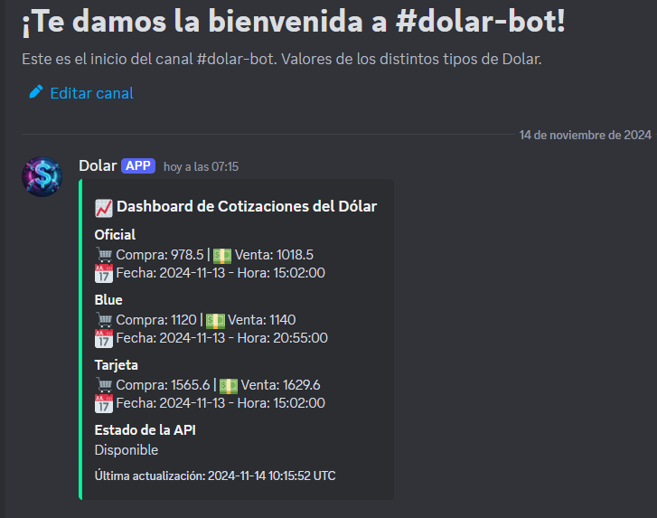
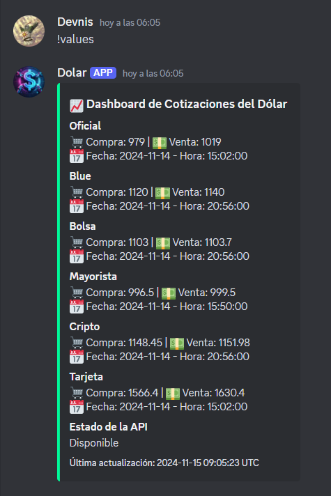
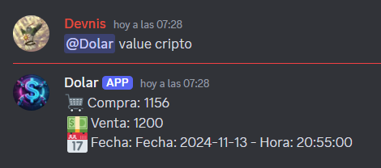
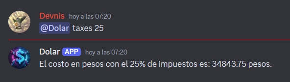
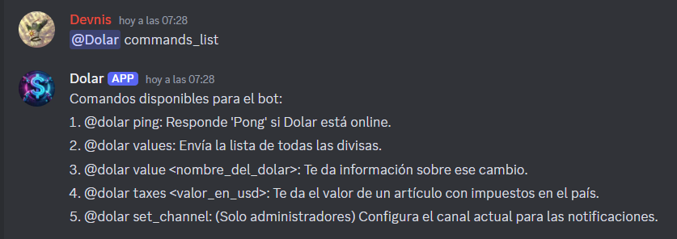

# DashMoney Bot

_DashMoney Bot es un bot de Discord diseñado para mantener actualizados los valores de los distintos tipos de dólar que existen en Argentina. La información se obtiene de la [API de Dólar](https://dolarapi.com/docs/argentina/), permitiendo a los usuarios acceder fácilmente a las tasas de cambio directamente desde su servidor de Discord._

## ¿Qué es DashMoney y para qué sirve?

- **Consultar valores del dólar**: Obtén información actualizada sobre los diferentes tipos de dólar disponibles en Argentina.

- **Calcular impuestos**: Calcula el valor de un artículo en dólares con los impuestos aplicados en el país.

- **Notificaciones automáticas**: Mantiene un mensaje actualizado en Discord con los valores más recientes del dólar.

- **Mantener el canal limpio**: El bot elimina automáticamente los mensajes para mantener el canal lo más limpio posible. 
- **Interacción sencilla**: Utiliza comandos fáciles de recordar para obtener la información que necesitas rápidamente.

- **Herramienta útil para comunidades**: Ideal para comunidades de usuarios que necesitan estar al tanto de las variaciones del dólar sin salir de Discord.

## Características principales

- **Comandos personalizados**: Una variedad de comandos para interactuar con el bot y obtener información relevante sobre el dólar.

- **Actualización de dashboard**: Mantiene un solo mensaje en Discord con los valores actualizados, evitando la saturación de mensajes.

- **Cálculo de impuestos**: Permite calcular el costo final de un artículo en dólares incluyendo los impuestos.

- **Fácil configuración**: Los administradores pueden configurar el canal de notificaciones con un simple comando.

- **Eliminación automática de mensajes**: Mantiene el canal ordenado eliminando mensajes innecesarios.

## ¿Cómo se utiliza?

### Añadir el bot a tu servidor de Discord

_Invita a DashMoney utilizando el siguiente enlace://_

[Invitar a DashMoney Bot](https://discord.com/oauth2/authorize?client_id=1259694006028210266)

### Configurar el canal

Un administrador debe establecer el canal donde el bot enviará las notificaciones utilizando el comando:

## Comandos disponibles

1. **Ping**: Verifica la latencia del bot.

   **Comando:** `@dolar ping`

2. **Valores del dólar**: Envía la lista de todas las divisas disponibles.

   **Comando:** `@dolar values`

3. **Valor específico del dólar**: Obtiene información sobre un tipo de dólar específico.

   **Comando:** `@dolar value <nombre_del_dolar>`

4. **Calcular impuestos**: Calcula el valor de un artículo en dólares con impuestos aplicados.

   **Comando:** `@dolar taxes <valor_en_usd>`

5. **Configurar canal de notificaciones**: (Solo administradores) Configura el canal actual para recibir las notificaciones actualizadas.

   **Comando:** `@dolar set_channel`

**Nota:** El bot elimina los mensajes automáticamente para mantener el canal lo más limpio posible.

## Instalación y despliegue

### Requisitos previos

- **Python 3.11 o superior**
- **Dependencias**: Listadas en `requirements.txt`
- **Token de bot de Discord**: Necesitas un token de bot de Discord para ejecutar DashMoney Bot o utilizar la aplicación desde el enlace proporcionado.

### Pasos para ejecutar el bot localmente

- 1. **Clonar el repositorio:**

`git clone https://github.com/DevnisG/DashMoney-Bot.git`

- 2. **Acceder al directorio del proyecto:**

`cd DashMoney-Bot`

- 3. **Instalar las dependencias:**

`pip install -r requirements.txt`

- 4. **Configurar el token de Discord:**

`DOLAR_DISCORD_TOKEN=el_token_de_tu_app`

## Contacto

Desarrollado por @DevnisG. Para preguntas o soporte, puedes contactarme a través de:

**Correo electrónico:** denis.gontero.2000@gmail.com

## Imágenes

1. 
2. 
3. 
4. 
5. 

